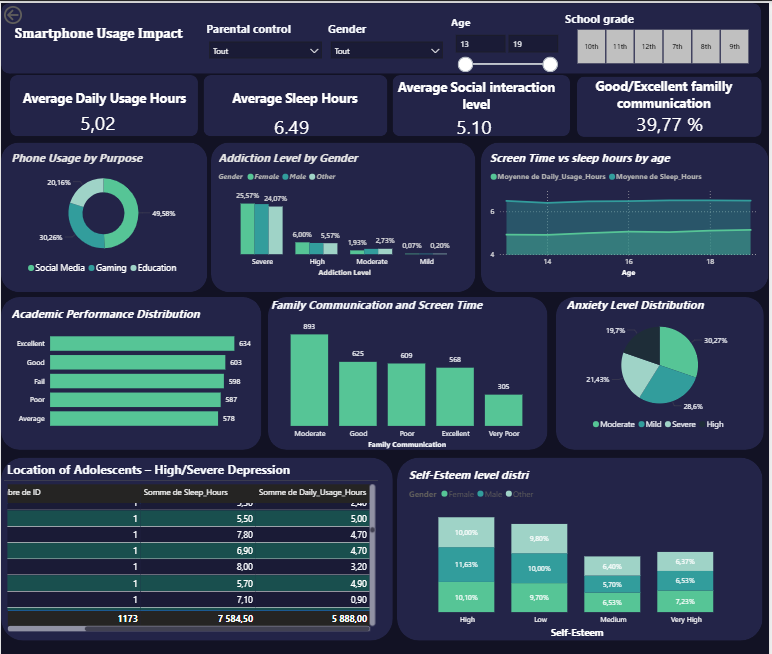

## Description
Aujourd'hui, le smartphone est devenu le compagnon quotidien des adolescents. Il ouvre la porte à l'information, au divertissement et aux interactions sociales. Mais derrière ces avantages, des questions persistantes : cet usage influence-t-il leur bien-être, leur sommeil, leur réussite scolaire ou leurs relations sociales ?
## Objectifs du projet
•	Évaluer l’impact du temps passé sur le smartphone sur la vie scolaire, sociale et psychologique des adolescents.
## Méthodologie
1.	Collecte des données :  le dataset  comporte 3001 lignes et 25 colonnes  (nom d’adolescents, ID adolescents , activité ,variables mesurées : temps d’écran, sommeil, performances académiques, interactions sociales, anxiété, dépression, addiction etc.).
2.	Préparation : nettoyage des données, transformation des variables qualitative en variables quantitatives (par exemple : création d’indicateurs comme "Parental Control activé/désactivé", "niveau d’addiction", « niveau de dépression », « niveau d’estime de soi », « performance académique »).
# Outil utilisé
 Power BI 
## Indicateurs et visualisations clés
•	Temps de sommeil moyen
•	Temps d’utilisation moyen par jour
•	Niveau moyen d’interaction social
•	Phone usage by purpose
•	Addiction level by gender
•	Screem time vs sleep hours
•	Academique distribution
•	Family communication distribution
•	Axiety level distribution
•	Self esteem level by gender
•	Location of adolescenta-high/severe depression

## Résultats et analyses 
- Temps d’écran et sommeil :le temps moyen  d’usage quotidien augmente avec l’âge, le temps moyen de sommiel tourne toujours autour de a moyenne generale  qui est largement inferieur au temps recommandé.
- les activités principales sur smartphone sont social media et le gaming . Bien que ce graphique ne soit pas lié aux autres indicateurs, il fournit un aperçu des usages.
- Performances académiques : La distribution montre que la majorité des adolescents se situent dans la  catégorie excellent
- Santé mentale : La proportion est plus élevée pour le niveau d’addiction sévère et élevée,  avec un pourcentage  legerement  elevé pour les filles par  rapport aux autre genre .Cela suggère une legere sensibilité différente selon le genre face à l’usage intensif du smartphone.
-	Les adolescents présentant une dépression élevée ou sévère montre que peuvent avoir des heures de sommeil et  d’utilisation très variables, allant de 4 à 10 heures par 24h. Cela suggère que le nombre d’heures de sommeil de d’utlisation n’est pas un facteur déterminant pour la dépression dans cette population.ous notons que la proportion du genre féminin est plus importante. 
- la majorité des adolescents se situent au niveau moyen ou élevé d’estime de soi, ce qui peut jouer un rôle protecteur face à l’impact négatif d’un usage intensif du smartphone sur la santé mentale
- 41,81% des adolescents ont une anxiété severe ou high,  ce qui represente une proportion assez importante nécessitant une attention particulière.
- Interactions sociales : paradoxalement, si le smartphone permet de rester connecté virtuellement, les données montrent que l’usage excessif réduit les interactions sociales réelles car sur une echelle de 1 à 10 la moyenne du niveau d’interaction
-	La majorité des adolescents déclarent une communication familiale bonne ou excellente, ce qui montre que le smartphone n’a pas altéré la qualité des échanges dans le foyer
## Visualisation

